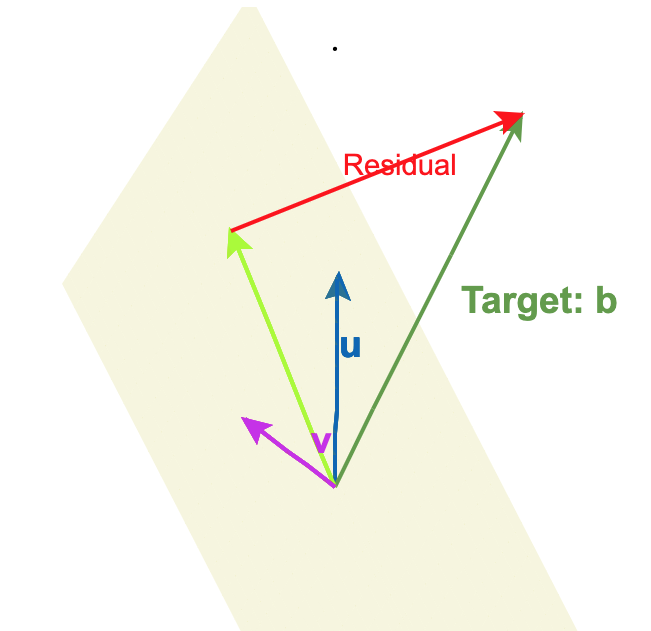
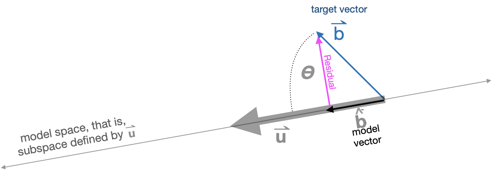

```{r setup, include=FALSE}
knitr::opts_chunk$set(echo = FALSE)
library(Zcalc)
library(Znotes)
```

::: {.hidden}
$$
\let\origvec\vec
\let\origmathit\mathit
\let\orighat\hat
\let\origbar\bar
\newcommand{\vec}[1]{\overset{{\rule[-1pt]{0mm}{1mm}}\rightharpoonup}{\mathbf{#1}}}
\newcommand{\bar}[1]{\overset{{\rule[-1pt]{12pt}{.5mm}}}{\mathbf{#1}}}
\newcommand{\mathit}[1]{\underset{\leftharpoondown}{\overset{{\rightharpoonup}}{\large\mathbf #1}}}
\newcommand{\hat}[1]{\widehat{\ \mathbf#1\ }}
\newcommand{\len}[1]{{\|{\mathbf #1}\|}} 
$$
:::

The use of mathematics in the worlds of science, management, and the economy has increased dramatically in the last half century. Much of this relates to the collection and interpretation of data, now routinely performed at a scale unanticipated even 25 years ago. Statistics, data science, and machine learning are now an part of the professional toolkit for workers in the information economy.

This paper discusses an opportunity, via linear algebra, for the university-level mathematics curriculum to forge genuine connections to statistics and data science and the foundations of machine learning.

The substantial change in the university-level mathematical sciences curriculum in the last 50 years is the ubiquitous offering of introductory statistics courses. Statistics has practically become part of general education at the university level and is the technical subject required by the widest range of fields.

The flavor of statistics most widely taught has little or no connection to the historical mainspring of university mathematics: calculus. Indeed, statistics is often seen as an *alternative* to calculus or pre-calculus. For students in many fields such as the health or social sciences, where requirements for calculus and its pre-requisites form a major, unneeded barrier to entry into professional work, statistics as an alternative to calculus makes good sense.

The disconnect between statistics and calculus is unfortunate in other ways (Kaplan 2013). One problem is that the conventional introductory statistics course is based on arithmetic procedures from the late 1800s and early 1900s and therefore fails to provide the concepts and methods needed for large scale work with data in realistically complex settings. Machine learning and Bayesian statistics are virtually inaccessible to graduates of introductory statistics.

Another unfortunate consequence of the separation of statistics and calculus is that those students whose work necessitates a solid introduction to calculus cannot apply the concepts and skills that they learn to their statistics studies; introductory statistics courses are not set up to draw on appropriate topics from calculus.

The same is true going the other way. There is little or no content in the first three or four semesters of a conventional calculus curriculum designed to foster statistical thinking. It seems likely this is due to the calculus curriculum being set before the advent of widespread professional use of data and the misconception among many mathematicians that formal probability is at the core of statistics. (In fact, simple notions of randomness coupled to modern computing are an effective way of introducing statistics. See LOCK 5, George Cobb Ptolemaic curriculum.)

A major opportunity for substantial connections between calculus and statistics arises in what is usually a fourth- or fifth-semester course: linear algebra. In practice, this opportunity is lost due to two problems: 1) only a very small fraction of students starting in Calc I will ever reach linear algebra; and 2) the topics selected for the mainstream linear algebra curriculum focus on issues such as Gaussian elimination, the invertibility of matrices, and determinants that are largely irrelevant to statistics.

Neither of the above two problems is an inevitable consequence of the nature of calculus or of linear algebra. The modeling-based calculus, statistics, and computing curriculum promoted by Project MOSAIC is one attempt to circumvent such problems. The statistics arm of Project MOSAIC centers on modeling, randomization, and accessible high-level computing. The calculus arm of the project focuses on a short, accessible, and comprehensive introduction to calculus. Here, "comprehensive" refers to including functions of multiple variables, differential equations, and linear algebra in the first one or two semesters of calculus.

This paper describes how concepts and methods of linear algebra well suited to professional work with data are presented in the MOSAIC calculus curriculum. 

[Austin's idea: connections of calculus to "Statistical Rethinking"]

## Calculus background to linear algebra

A student who completes the traditional first two semesters of calculus, browsing the ample shelf of linear algebra texts, would be hard pressed to see any connection of their calculus studies to what is found in the linear algebra textbooks. There are exceptions, but a prevalent way of introducing linear algebra often starts with systems of linear equations and how to solve them. A person unaware of the manifold uses of linear algebra might see the subject as an extension of high-school algebra, where the solution of two linear equations in two unknowns is a standard topic.

Why linear algebra should be postponed to late in the calculus sequence is, to me, something of a mystery. Some possible reasons: calculus is seen as a topic of higher priority; vectors are typically introduced in third-semester calculus; linear algebra is, in some curricular organizations, allied with differential equations, which typically comes late in the calculus sequence.

In the MOSAIC curriculum, calculus is taught from a modeling perspective. This means that students are, from the beginning, learning fundamentals of mathematical modeling. This includes a basic set of functions, e.g. exponential, power-law, log, sinusoidal, etc. and ways of putting the basic functions together to form models. The three main ways of combining functions are composition, multiplication, and linear combination. The term "linear combination" comes early in the MOSAIC curriculum. Students first encounter it in the selection of parameters in models of simple oscillatory phenomena ($A + B \sin(2 \pi \omega t)$) or exponential decay ($A + B e^{-kt}$) in choosing $A$ and $B$ to match the model function to data.

Another important theme in the MOSAIC curriculum is using low-order polynomial approximations---including in two or more variables---as a modeling framework. For instance, in the case of a function with two inputs, the modeler's task is to choose which terms to include from among the following:

$$f(x, y) \equiv \underbrace{a_0 + a_x x + a_y y}_{\text{almost always}} + \underbrace{a_{xy} x y}_{\text{interaction}} + \underbrace{a_{xx} x^2 + a_{yy} y^2}_{\text{quadratic terms}}$$
This is, of course, a linear combination of the functions $1, x, y, xy, x^2,$ and $y^2$.

Students learn to incorporate an interaction term if the effect of $x$ on the output depends on $y$, and to include one or both quadratic terms only if the phenomenon being modeled involves an extremum. Once such decisions have been made, the task of modeling is to infer the signs and magnitudes of the coefficients in the linear combination. This can be done to correspond with an understanding of the mechanism of the system, or to match the model to example cases with inputs and outputs recorded.

Since MOSAIC calculus involves functions with multiple inputs early, the gradient vector also appears, to understand the "shape" of such functions and to perform routine tasks such as optimization. (Many students will also see vectors in physics or engineering courses that are co-requisites for calculus.)

As a start, students pick the coefficients on linear combinations by eye and then through software. By the time the linear algebra component of the MOSAIC curriculum begins, students have been working extensively with linear combinations and vectors. The problem of finding coefficients for linear combinations becomes the chief motivation for introducing linear algebra. 

Later in the MOSAIC course, students encounter dynamics/differential equations where the analysis of fixed points is a central topic. Such dynamics involve characteristic behavior that can be understood in terms of eigenvectors and eigenvalues.

## The target problem

To judge from most textbooks in the field, there is a set of canonical topics covered by a  linear algebra course: matrices as a rectangular array of numbers, the solution of sets of linear equations by row operations, matrix multiplication, matrix inverses, determinants, eigenvalues and eigenvectors. In the MOSAIC curriculum, we did not seek to cover topics, but rather to provide the concepts and apparatus needed to solve what we call the "target problem."

A good setting to describe the target problem is statistical modeling. The MOSAIC calculus curriculum is strongly grounded in mathematical modeling and an important class of modeling situations involves constructing from data a model of one variable as a linear combination of other variables. To illustrate, consider data on the properties of internal combustion engines
such as that provided by McMahon and Bonner (1983) available in the `engines.csv` file at <http://www.mosaic-web.org/go/datasets/engines.csv>. Thirty-nine different engines are represented with properties such as mass, stroke length, piston bore, displacement, rpm, and power output. Constructing models relating these properties to each other, such as displacement as a function of stroke length and piston bore reveals how such engines work. 

```{r echo=FALSE}
set.seed(101)
Znotes::and_so_on(Engines[sample(1:39),]) %>% kableExtra::kable_styling()
```

Much of any modeling problem is outside the scope of linear algebra, e.g. choice of the explanatory variables and possible nonlinear transformations of those variables. Once these choices have been made, construction of a linear model is a matter of computation, using linear algebra techniques. (Usually there is a cycle of modeling, where interpretation of one model leads to a reconsideration of the variable choices, etc.) 

For instance, a (naive) model of displacement as a function of bore and stroke might involve a linear algebra problem like this one, to be solved for $\vec{x}$:

$$\underbrace{\left[\begin{array}{rrr}1 & 15.9 & 14\\
1 & 239.0 & 254\\
1 & 100.0 & 87\\
\vdots & \vdots & \vdots\\
1 & 133.0 & 127\\
1 & 105.0 & 129
\end{array}\right]}_{\text{model matrix}} 
\left[\begin{array}{c}x_1\\ x_2\\x_3\end{array}\right] \approx 
\underbrace{\left[\begin{array}{r}20\\183000\\2800\\\vdots\\12400\\7200\end{array}\right]}_{\text{`target'}}\ .$$
[Aside: One modeling skill, covered earlier in the MOSAIC curriculum, is to consider using a logarithmic transform of the variables. That would be very appropriate here.]

The "target problem" is to find the linear combination of the vectors in the model matrix to get as close as possible to the target vector. A more conventional name for this is "least squares."

In a conventional linear algebra course, least squares is inaccessible until many other topics have been mastered: matrix multiplication, transposes, inversion, and so on. In the MOSAIC curriculum, roughly a sixth of the two-semester sequence is available for linear algebra, meaning that it's hardly possible to follow the conventional sequence and get to least squares. On the other hand, the conventional topics are not needed to solve the problem and to gain a good theoretical understanding of the *relevant* properties of the solution. 

## MOSAIC topics

In choosing topics for the linear algebra component of the MOSAIC curriculum, we sought to find the most compact set of ideas that give a coherent and meaningful explanation of the target problem. (Eigenvalues and eigenvectors are not part of that compact set, but they are introduced later in the dynamics part of the MOSAIC curriculum and will be covered in a later section of this paper.) 

A full presentation of the MOSAIC topics is available through the online textbook, available at <http://www.mosaic-web.org/MOSAIC-Calculus/block-5/vectors.html>. A brief listing will suffice for our purposes here:

- Chapter 41: Vectors: length and direction, vectors in n-dimensional space, angle between vectors, orthogonality, arithmetic calculation of length and angle, the dot product.
- Chapter 42: Linear combinations of vectors: vector addition, subtraction, scaling, linear combination, matrices as collections of vectors, collections of vectors defining a subspace.
- Chapter 43: Projection and residual: projection onto a single vector, projection onto a set of vectors (particularly a set of orthogonal vectors), construction of an orthogonal basis for a subspace, construction of the model vector and the residual vector.
- Chapter 44: The target problem: finding the coefficients of the linear combination of the vectors in the model matrix to reach the projection of the target onto the model subspace.
- Chapter 45: Statistical modeling and R^2^: translating the target problem into the format and terminology used in statistical modeling.
- Chapter 46: Functions as vectors: generalizing the dot product so that functions can be treated as vectors, the Fourier basis.

## MOSAIC conventions

In developing a student's understanding of projection and the target problem, it helps to reduce the cognitive load imposed by notation and nomenclature. To this end, we use certain conventions.

Since this paper is oriented to instructors who are familiar with the material covered in Chapters 41 to 45, we'll work backwards from the way vector and matrix notation is presented to students.

- The ***target problem*** is "find the coefficients $\vec{x}$ such that $\mathit{A}\,\vec{x} = \vec{b}$" where $=$ is understood to mean "as close as possible."
- The ***model matrix*** is $\mathit{A}$ and contains the vectors that will be included in the linear approximation. Some will find heavy handed the double-arrow annotation used to identify matrices, but we want constantly to remind students that a matrix is a collection of vectors.
- The ***model subspace*** is the subspace spanned by $\mathit{A}$.
- The ***target vector*** is $\vec{b}$.
- The coefficients for the linear combination are contained in $\vec{x}$, which we find by solving the target problem.
- The ***model vector***, written $\hat{b}$, is the projection of $\vec{b}$ onto the model subspace. 
- The ***residual vector***, $\vec{r}$, is the component of $\vec{b}$ orthogonal to the model subspace. More simply, $\vec{r} = \vec{b} - \hat{b}$.

A key strategy of the course is to present most every object and concept in four modes:

1. **Graphically**. A vector is an arrow of a specified length and direction. As needed, we use three dimensional graphics where the student can interactively vary the orientation of the graphic. 
2. **Metaphorically**. A vector is a **step** in the corresponding direction and of the corresponding length. A linear combination is a trip in which steps are taken successively in the directions of the vectors being combined. The scalar coefficients of the linear combination is the number of steps in each of the directions.
3. **Arithmetically**. A vector is a **column** of numbers. (We don't introduce row vectors at all.) Basic arithmetic operations on a single vector are scaling and length. With two vectors, the basic operations are addition, subtraction, and the dot product.
4. **Computationally**. There are, of course, many suitable choices for the computing environment, such as MATLAB, Mathematica, or Maple. We think R has important advantages and that is what we use. We'll say more about computation below.


### Graphical mode

A pitfall of graphical presentations is that students can (understandably) confuse a vector with a coordinate point. We emphasize the rootlessness of vectors from the very beginning. You can place a vector wherever best suits your needs. For vector addition, the easy placement is head to tail while for subtraction and the included angle, tail to tail. To reinforce the point, early problems involve vectors drawn in arbitrary positions where the student's first step is to move the vectors into an appropriate position to carry out the operation visually. For the most part, the graphics do not include a coordinate grid. (The exception is the very narrow topic of converting between the graphical and arithmetic depictions of vectors.)

To illustrate, here is a simple exercise based in the graphics domain:

Consider the vectors in Figure \@ref{fig:many-vectors}
```{r many-vectors, echo=FALSE, out.width="3.5in", fig.cap="The vectors to reference in answering questions (a) through (e)."}
knitr::include_graphics("www/many-vectors1.png")
```
a. Remembering that mathematical vectors have only two properties---length and direction---how many different mathematical vectors are being shown. (Answer: Five. Color is not a property of a mathematical vector. Orientation, however, is.)

b. Measure the length of each vector. (Hint: Use a ruler! You can round to the nearest millimeter.)

c. Find the included angle between the $\color{blue}{\text{blue}}$ and $\color{brown}{\text{brown}}$ vectors. (Your answer should be correct to within $\pm 15^\circ$.) (Answer: About 135 degrees. Note that the orientation makes a difference. The angle is measured with the vectors placed tail to tail.)

d. Find the included angle between the $\color{magenta}{\text{magenta}}$ and $\color{blue}{\text{blue}}$ vectors. (Answer: Magenta points in the same direction as brown, so the answer is the same as in 
the previous question.)

e. Find the included angle between 0.7 times the $\color{blue}{\text{blue}}$ vector and -11.3 times the $\color{brown}{\text{brown}}$. (Answer: The scaling doesn't matter except that the negative sign for the brown vector means that its orientation will be reversed. This means that the included angle will be 45 degrees, not 135 degrees as in the previous two questions.)

-----

As another example of the graphics mode of presentation, 
the target problem with $\mathit{A} = \left[\vec{u}\ \ \vec{v}\right]$ is shown in Figure \@ref(fig:target-diagram) 

[](target-diagram.html)

```{r target-diagram, echo=FALSE, fig.cap="The target problem with vectors with three components and two vectors in the model matrix. Click on the image to open an interactive version of the diagram."}

```

### Metaphorical mode

As stated above, the central metaphor for the target problem is that of a journey in the directions provided by the vectors in $\mathit{A}$. The destination is the tip of the target vector, the starting point is the tail of that vector. 

The journey can be analogized to getting from a train station to a particular building in a city with a street/avenue grid. From the station, one walks along a street until reaching the avenue on which the building is located, then walk along the avenue. 

We have not found a city with a skew street grid, so to illustrate the journey with non-orthogonal $\mathit{A}$ we appeal to Greek mythology where there are wind gods. For instance, Boreas is the god of the north wind and Apeliotes is the southeast wind. A sailor wishing to go from Troy to, say, Ithaka might call first upon Boreas to reach the Mediterranean, then turn to Apeliotes to carry the boat to Ithaka.

An effective table-top demonstration is to mark on the table the point of a tail for $\vec{b}$. A student is assigned to hold some soft object above the table to mark the tip of $\vec{b}$. The projection $\hat{b}$ is found by dropping the object onto the table. Then toss two pencils onto the table to set the vectors $\vec{u}$ and $\vec{v}$. The students are called on to figure how many pencil steps to take in each direction to reach the tip of $\hat{b}$ from its tail. A larger scale version of this game uses the floor as the subspace and a student's stride-length as the step. $\vec{b}$ is a vector from some point marked on the floor to an object on the ceiling, such as a light or projector. Two rulers are placed onto the floor to mark the directions of the vectors in $\mathit{A}$. It also works well to add a third vector to $\mathit{A}$ that has a non-zero vertical component. Students can't walk along this third vector, but they can use it as a pointer to figure out the position they need to reach on the floor so that the third vector can be used to complete the journey. 

### Arithmetic mode

Arithmetic with vectors is handled in the conventional way, component by component. The embedding dimension of a vector is the number of components in the vector. Addition, scalar multiplication are intuitive. The dot product is introduced for the calculation of lengths and included angles. Later, the dot products are used to find the projection $\hat{b}$ of a vector $\vec{b}$ onto another vector $\vec{u}$, a formula found in standard textbooks:  $$\hat{b} = \frac{\vec{u} \bullet \vec{b}}{\vec{u} \bullet \vec{u}}\, \vec{u}\ .$$ 

The large dot $\bullet$ used to denote the dot product is unconventional, but it helps distinguish dot project from component-wise multiplication. 

We do not define the dot product in terms of matrix multiplication as would conventionally be denoted $\mathbf{b}^T\, \mathbf{u}$. We omit this as part of our policy of avoiding row vectors and transposes.


### Computational mode

It's common nowadays for linear algebra to be taught with a computational component. In the *MOSAIC Calculus* text, we use R with the `mosaic` and `mosaicCalc` packages. We will use the R notation here, but it should be straightforward to map the examples onto other computational environments such as MATLAB.

The `mosaic` and `mosaicCalc` packages add useful functions for the entire *MOSAIC Calculus* course, including function oriented graphics, symbolic and numerical differentiation and anti-differentiation, numerical integration, ODE solving, and so on. It also adds some convenience functions for vector and matrix calculations. To install the packages, `mosaicCalc` package, use these commands:
```{r eval=FALSE}
install.packages("mosaic")
remotes::install_github("ProjectMOSAIC/mosaicCalc", ref="beta")
```

Installation is a one-time process. In day-to-day work, for each R session, you need merely reference the packages to make the software they contain available:
```{r eval=FALSE}
library(mosaic)
library(mosaicCalc)
```
Most of the linear-algebra commands we use in *MOSAIC Calculus* are part of base R. The exceptions are `%dot%`, `%onto%`, and `%perp%`, which will be introduced below.


NOTE IN DRAFT: Currently, the best way to install the *MOSAIC Calc* software is via a package called `Zcalc`. The one-time installation is done with 
```{r eval=FALSE}
remotes::install_github("dtkaplan/Zcalc")
```
and the only library call that needs to be given explicitly is
```{r eval=FALSE}
library(Zcalc)
```
END OF NOTE IN DRAFT


There are two distinct scales at which the students should be comfortable with the basic computations.

1. A demonstration scale involving vectors with a handful of components.
2. An application scale where vectors are drawn from realistic data sources. 

For demonstration scale problems, students construct column vectors using a base R function, `rbind()`. (The name stands for "bind rows together.") For example:

```{r}
u <- rbind(8,-2,4)
v <- rbind(3,2,7)
u
v
```

Scalar multiplication and vector addition are handled natively:
```{r}
v + 10*u
```

We've added an infix operator for the dot product:
```{r}
v %dot% u
```
Note that we don't use matrix multiplication (which is `%*%` in R) to calculate a dot product. This would require constructing a row vector, but we keep the MOSAIC curriculum column oriented.

The projection of one vector onto another can be demonstrated using the dot product, but we prefer to use a convenience function `%onto%`. 
```{r}
(v %dot% u) * u/(u %dot% u)
v %onto% u
```
The residual from a projection can be computed directly from the definition of the residual, but again we provide a convenience function:
```{r}
v - (v %onto% u)
v %perp% u
```
Matrices are constructed with `cbind()` applied to (column) vectors:
```{r}
cbind(u, v)
```
Those familiar with R will know the base `matrix()` function. We do not use `matrix()` because it is strongly oriented toward arranging individual scalar components and not to assembling a matrix as a collection of vectors.

At the *application scale*, vectors are constructed from data frames. In R, a data frame is the standard format for accessing a rectangular array of data. We'll illustrate with the data used earlier in this paper on the properties of internal combustion engines.

R makes it straightforward to load data from external sources. For example, to load the engines data from the URL, use the command
```{r eval=FALSE}
# Reading from a URL, 
Engines <- read.csv("http://www.mosaic-web.org/go/datasets/engines.csv")
```
But many data frames, including `Engines`, are available directly by name from the `mosaic` and `mosaicCalc` packages, so you should refer the `read.csv()` method for data sets currated by individual instructors for their courses.

Suppose that we want to model the horsepower (`BHP`) of an engine as a function of displacement and RPM. We would first pull out the horsepower as the $\vec{b}$ vector and displacement and RPM as the vectors to be projected onto. Here, we'll transform the raw data into logarithmic form, as suits the power-law nature of engine relationships.
```{r}
b <- with(Engines, log10(BHP))
disp <- with(Engines, log10(displacement))
rpm <- with(Engines, log(RPM))
```
Constructing the matrix $\mathit{A}$ containing `disp` and `rpm` is done with `cbind()`. (The name stands for "bind columns together.")
```{r}
A <- cbind(disp, rpm)
```
In statistical modeling, one would usually add a column of 1s, called the "intercept vector" and perhaps other terms such as the product of `disp` and `rpm`. As an example, we'll do that now:
```{r}
A <- cbind(1, disp, rpm, disp*rpm)
```

This is a by-hand approach for constructing vectors and matrices from data frames. In professional work, one would use the standard R functions `lm()` or `model.matrix()`. The notation for using these functions is introduced early in the *MOSAIC Calculus* course, but as we haven't introduced it in this paper, we'll skip it.

What's the linear combination of the vectors in `A` that reaches closest to `b`?
```{r}
x <- qr.solve(A, b)
x
```
The model vector and residual vector can be calculated by combining the vectors in `A` using the coefficients in `x`:
```{r}
bhat <- A %*% x
```
But if you don't need the `x` coefficients, you can use `%onto%` and `%perp%` instead:
```{r}
bhat <- b %onto% A
resid <- b - bhat
# or
resid <- b %perp% A
```
Confirmation that the residual vector is indeed perpendicular to the model vector:
```{r}
bhat %dot% resid
```
Confirmation that the model vector plus the residual vector gives `b`:
```{r}
sum((bhat + resid - b)^2)
```


## Projection, not inversion

To summarize for the knowledgeable instructor how we solve the target problem: We use QR decomposition. We present an algorithm for the construction of Q but do not cover the construction of R. This would be feasible graphically and arithmetically for subspaces defined by two vectors, but such a demonstration did not have a high priority for classroom time. Instead, we rely on software for the calculation of the coefficients $\vec{x}$ in the target problem.

To highlight the differences between the approach in the MOSAIC curriculum from a conventional curriculum, let's consider first what a conventional presentation of the target problem might look like.

1. We have a matrix $\mathbf{A}$ with more rows than columns and we seek to find $\mathbf{A} \vec{x} = \vec{b}$. Because $\mathbf{A}$ is not square, it does not have an inverse and so there is in general no solution. 

2. We can transform the problem into one that can be solved by multiplying both sides of $\mathbf{A} \vec{x} = \vec{b}$ by $\mathbf{A}^T$, getting
$$\mathbf{A}^T \mathbf{A}\, \vec{x} = \mathbf{A}^T\, \vec{b}$$
3. The matrix $\mathbf{A}^T \mathbf{A}$ is square and might therefore have an inverse. If so, we can invert it to find $\vec{x}$:
$$\vec{x} = (\mathbf{A}^T \mathbf{A})^{-1}\mathbf{A}^T\, \vec{b}$$
4. We call $(\mathbf{A}^T \mathbf{A})^{-1}\mathbf{A}^T$ the *pseudo-inverse of $\mathbf{A}$*.

Following this argument requires considerable background knowledge. We'll use *italics* to highlight those elements that are not covered in the MOSAIC curriculum. 

Step (1) calls for knowledge about *inverses* and non-square matrices. (The "in general" caveat is somewhat mysterious as stated but could be explained by constructing a non-square $\mathbf{A}$ and corresponding $\vec{b}$ that does have a solution $\vec{x}$, for instance a matrix consisting of two copies of an invertible square matrix stacked on top of one another.)

Step (2) uses the ideas of a *transpose* and *matrix-by-matrix multiplication*.

Step (3) raises the question of *when a square matrix does not have an inverse*.

Step (4) unnecessarily introduces new nomenclature (*pseudo-inverse*) and disparages the process as ungenuine.

We do not claim that the *italicized topics* listed above are not important to a thorough mastery of linear algebra. Our claim is merely that they are not needed to solve the target problem. In addition, the construction of the pseudo-inverse is somewhat disingenuous since this is not the method used by modern software to solve the target problem. (For $\mathbf{A}$ with many columns, the calculation is ill-conditioned and fails to recognize legitimate solutions even when $(\mathbf{A}^T \mathbf{A})^{-1}$ does not exist.)

Instead of involving matrix inverses, the MOSAIC approach is to divide the target problem into two parts:

a. Projection of the target vector $\vec{b}$ onto the model subspace, the space spanned by the vectors in $\mathit{A}$. The result of this projection is the model vector, $\hat{b}$, which lies in the model subspace.

b. Calculating the coefficients on the linear combination of the vectors in $\mathit{A}$ that reach---exactly---$\hat{b}$.

Both (a) and (b) can be presented graphically for for a one- or two-dimensional model subspace with vectors with two or three components. Projection onto a single vector $\mathit{A} = \vec{u}$ is a standard textbook diagram, as in Figure \@ref(fig:projection-1).

```{r projection-1, echo=FALSE, fig.cap="Projection of $\\vec{b}$ onto $\\vec{u}$"}

```


Projection onto a subspace spanned by two vectors is illustrated in Figure \@ref(fig:target-problem). 

The graphical (and metaphorical) presentation of finding the coefficients is shown in Figure \@ref(fig:2-coefs).

```{r 2-coefs, echo=FALSE, fig.cap="Finding the coefficients on $\\vec{u}$ and $\\vec{v}$ to reach the model vector $\\hat{b}$."}
knitr::include_graphics("www/u-v-spyglass.png")
```

By way of explanation, here is the explanation in the *MOSAIC Calculus* text: 

> Pick either $\vec{u}$ or $\vec{v}$, it doesn't matter which. In the diagram, we've picked $\vec{v}$. Align your telescope with that vector. Now march along the other vector, $\vec{u}$, carefully keeping the telescope on the bearing aligned with $\vec{v}$. From the diagram, you can see that when you've marched to $\frac{1}{2} \vec{u}$, the telescope does not yet have $\hat{b}$ in view. Similarly, at $1 \vec{u}$, the target $\hat{b}$ isn't yet visible. Marching a little further, to about $1.6 \vec{u}$ brings you to the point in the $\vec{u}$-subspace where the target falls into view. This tells us that the coefficient on $\vec{u}$ will be 1.6.

> To find the coefficient on $\vec{v}$, you'll need to march along the line of the telescope, taking steps of size $\|\vec{v}\|$. In the diagram, we've marked the march with copies of $\vec{v}$ to make the counting easier. We'll need to march *opposite* the direction of $\vec{v}$, so the coefficient will be negative. Taking 2.8 steps of size $\|\vec{v}\|$ brings us to the target.

The arithmetic and computational depiction of projection is rooted in a special case. Projection of a vector $\vec{b}$ onto the sub-space spanned by a matrix $\mathit{A}$ whose vectors are mutually orthogonal is easy: Just project $\vec{b}$ onto each of the vectors in $\mathit{A}$ one at a time. Adding up those one-at-a-time projections gives $\hat{b}$. 

Constructing an orthogonal basis for $\mathit{A}$ is easily accomplished with the Gram-Schmidt process. We demonstrate the algorithm, but don't require students to recall it from memory. The emphasis for the student is to be able to confirm that the set of orthogonal vectors are mutually perpendicular and that any vector in $\mathit{A}$ can be constructed as a linear combination of the orthogonal vectors.

To illustrate, here's the orthogonal version of vectors used in the previous example using `Engines`. 

```{r}
u1 <- rpm
u2 <- disp - (disp %onto% u1)
u3 <- rpm*disp - (rpm*disp %onto% cbind(u1, u2))
```

Confirming the orthogonality:
```{r}
u1 %dot% u2
u1 %dot% u3
u2 %dot% u3
```


## Eigenvalues and eigenvectors


## Discussion

There are linear algebra texts that do not follow the CCC. For example, Anton & Busby (2003) identify the fundamental concepts as "R^n^, orthogonality, linear combinations, spanning, subspaces, linear independence, and dimension." These are all encountered in the first chapter of their book.

The MOSAIC curriculum is far from alone in this column-centric approach to matrices. For example, the Lay, Lay, and McDonald textbook (2016) describes a "modern approach" to matrices, writing, "Good notation is crucial, and the text reflects the way scientists and engineers actually use linear algebra in practice. The definitions and proofs focus on the columns of a matrix rather than on the matrix entries. A central theme is to view a matrix–vector product Ax as a linear combination of the columns of A. This modern approach simplifies many arguments, and it ties vector space ideas into the study of linear systems."

In the CCC, where a matrix is presented as a rectangular array of numbers, the product of a matrix and a vector is often described this way:
$$\left[\begin{array}{cccc}a_{11} & a_{12} & \cdots & a_{1n}\\
\vdots &  \vdots & \vdots & \vdots\\
a_{m1} & a_{m2} & \cdots & a_{mn}\end{array}\right] \left[\begin{array}{c}x_1\\\vdots\\x_n\end{array}\right] = \left[\begin{array}{c}
a_{11} x_1 + a_{12} x_2 + \cdots + a_{1n} x_n\\
\vdots  \\
a_{n1} x_1 + a_{n2} x_2 + \cdots + a_{mn} x_n\\
\end{array}\right]\ .$$

In the column-oriented MOSAIC curriculum, it's hardly ever necessary to write out a rectangular array of numbers. Instead, we typically write matrix-vector multiplication like this:
$$\left[\begin{array}{cccc}|&|&&|\\\vec{v_1} & \vec{v_2} & \cdots& \vec{v_n}\\
|&|&&|\\\end{array}\right] \left[\begin{array}{c}x_1\\x_2\\\vdots\\x_n\end{array}\right] = 
x_1\,\vec{v_1} + x_2\,\vec{v_2} + \cdots x_n\,\vec{v_n}\ .$$


Vectors are explicit showing arrows.

Matrices are explicit showing two different arrows.

Write a column vector as a column. No row vectors.


## References

- Daniel T. Kaplan (2013) "Calculus and Statistics" *AMSTAT NEWS*, [link](https://magazine.amstat.org/blog/2013/07/01/calculus-and-statistics/)

- Lock 5

- George Cobb, Ptolemaic Curriculum

- Daniel T. Kaplan (2022) *MOSAIC Calculus*

- Howard Anton and Robert Busby (2003) *Contemporary Linear Algebra* Wiley

- David Lay, Steven Lay, Judi McDonald (2016) *Linear Algebra and Its Applications* (5/e), Pearson 

- Thomas McMahon and John Tyler Bonner (1983) *On Size and Life* New York: Scientific American Library, pp. 60-61
