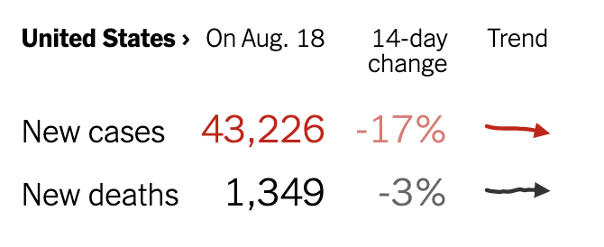

```{r include = FALSE, context = "setup"}
# Note the context="setup". That's so that the question_ui_initialize methods from etude will be registered.
library(Zcalc)
library(readxl)
library(lubridate)

sigmoid <- makeFun(A*pnorm(t,  center, width) ~ t)
hump <- makeFun(A*dnorm(t, center, width) ~ t)
slope <- function(f, delta = 1) {
  function(t) {
    (f(t+delta) - f(t-delta))/(2*delta)
  }
}

file <- "previous-case-counts.xlsx"
Ebola <- readxl::read_xlsx(file)
names(Ebola) <- c("date", "Gcases","Gdeaths",
                  "Lcases", "Ldeaths",
                  "SLcases", "SLdeaths", "cases", "deaths")
Ebola <- Ebola %>%
  mutate(date = ymd(date),
         day_num = 365*(year(date)-2014) + yday(date))

#readr::write_csv(Ebola, path="Ebola-edited.csv")
Ebola <- readr::read_csv("Ebola-edited.csv")
Ebola <-
  Ebola %>%
  mutate(
    day_num = 365*(year(date)-2014) + yday(date)
  ) %>%
  arrange(date)
SierraLeone_c <- smoother(SLcases ~ day_num, data = Ebola, degree=1, span = 0.03)
SierraLeone_d <- smoother(SLdeaths ~ day_num, data = Ebola, degree=1, span = 0.03)
SSierraLeon_d <- SierraLeone_d
total_c <- smoother(cases ~ day_num, data = Ebola, degree=1, span = 0.03)
total_d <- smoother(deaths ~ day_num, data = Ebola, degree=1, span = 0.03)
Liberia_c <- smoother(Lcases ~ day_num, data = Ebola, degree=1, span = 0.03)
Liberia_d <- smoother(Ldeaths ~ day_num, data = Ebola, degree=1, span = 0.03)
Guinea_c <- smoother(Gcases ~ day_num, data = Ebola, degree=1, span = 0.03)
Guinea_d <- smoother(Gdeaths ~ day_num, data = Ebola, degree=1, span = 0.03)
```


<a href="https://maa-statprep.shinyapps.io/141Z-R_command_guide" target="_blank">*R Command Guide*</a>


In this Project, we're going to examine a historical  instance of  the growth and decay of an epidemic. The purpose of our work will be to learn some lessons about responding to epidemics and to demonstrate the application of the techniques you have been learning to a genuine, real-world problem.


## The 2014-2015 Ebola outbreak

In December 2013, an 18-month-old boy from a village in Guinea suffered fatal diarrhea. He is believed to have been infected by bats. Over the next months a broader outbreak was discovered  and in mid-March 2014, the Pasteur Institute in France confirmed the illness as Ebola-Virus Disease (EVD) caused by  the  *Zaire ebolavirus*.

Although the outbreak was first recognized in Guinea, it eventually encompassed Liberia and Sierra Leone as well. By July 2014, the outbreak spread to the capitals of all three countries. Over the duration of the epidemic, EVD spread to seven more countries: Italy, Mali, Nigeria, Senegal, Spain, the United Kingdom, and the United States. Later secondary infection, mainly in a healthcare setting, occurred in Italy, Mali, Nigeria, and the United States. (This description is paraphrased from the [CDC description of the outbreak](https://www.cdc.gov/vhf/ebola/history/2014-2016-outbreak/index.html).)

We're going to examine the time course of the epidemic using [data provided by the US Centers for Disease Control](https://www.cdc.gov/vhf/ebola/history/2014-2016-outbreak/case-counts.html) and concepts and techniques we have been studying in the first block of Math 141Z.

## Data

The CDC data are provided to you as a data frame named `Ebola`. The table consists of 260 reports spread out over the time course of the epidemic. Each row is one such report giving the *cumulative* number of cases and  deaths in  each country,  as well as the totals over all three countries.


```{r echo=FALSE}
knitr::kable(head(Ebola))
```

Although it is tempting to regard such data as definitive, they are the culmination  of an imperfect process of data collection in the field and imperfect processing/correction/amendment by people. For instance, most of the cases (and deaths) in the epidemic were never confirmed by viral testing and are considered "suspected cases." Cases and deaths reported on one day might possibly be from previous days, and some cases and deaths were, no doubt, not reported.


```{r daily-digital-11-Essay5, echo=FALSE}
etude2::etudeEssay(
  prompt = "The report for June 24, 2014 shows a cumulative  34 deaths in Sierra Leone. But this report is inconsistent with the surrounding reports. Why might that have happened? (Hint: The data  is wrong. What  might  have  happened such  that wrong data was entered? Use your imagination.)"
)
```

<!-- Presumably the inconsistencies are due to data transcription errors or retrospective but incomplete "correction" of earlier or later reports.-->


Use `gf_point()` to plot out the number  of cases in Sierra Leone (variables `date` and `SLcases` in dataframe `Ebola`).

```{r daily-digital-10-sandbox1, exercise=TRUE, exercise.cap="Sandbox",  exercise.eval=FALSE, exercise.lines=7, exercise.completion=FALSE, exercise.startover=TRUE, exercise.diagnostics=TRUE, eval=FALSE}

```


**Essay**: Looking at the shape of the graph, which one of the types of functions we have studied would be most appropriate as a model of the cumululative number of cases?


**Essay**: Identify some places where the graph is obviously inconsistent with the statement that `SLcases` is the cumulative number of cases.

Remake the graph, using `day_num` for the horizontal axis rather than `date`. Estimate roughly but reasonably the top plateau of the number of Sierra Leone cases and the day number when the cumulative number of cases reached the half-way point. From these, estimate the parameters of the standard sigmoid function (that is, `A`, `center`, `width`).

Confirm your estimates by adding  a new layer new  graphics on  top  of the  data. Do this  by   piping  the  data layer to

`slice_plot(sigmoid(day_num, A, center, width) ~ day_num)`

Make   sure to   replace `A`,  `center`,   and  `width`  with your estimates.

**Essay**: Do you  think the sigmoid function that you estimated would make a good model of the data? That is, could your sigmoid be used meaningfully  to understand changes in the month-to-month dynamics of the spread of the outbreak.

##  Cleaning

An essential part of all projects involving data is to ensure the correctness of the data being used, a process sometimes called "data cleaning." As important as this is, data cleaning is not one of the topics in Math 141Z. So we have done this job for you. This  section explains the form of the cleaned data so that you can  work with it later.

- `Ebola` -- the data frame as it was downloaded from the CDC.
- Dates: Using the actual `date` is important in communicating results to people, as it provides a means to correlate the data with other events. But dates are complicated for doing computation. (Quick! How many days between January 15, 2014 and Feb 4, 2016. See, that's hard.)  So we have added a variable `day_num` which is 1 for January 1, 2014. (We added this column to `Ebola`).
- Time base: The interval between reports in `Ebola` varies. It's helpful for mathematical analysis to have data spaced at equal intervals.
- Cumulative: It also helps mathematical analysis if variables that are mathematically monotonically non-decreasing (e.g. *cumulative cases*) are presented in a format that enforces this as a constraint, removing glitches from the data.

Rather  than  working directly  with the CDC data, you have available a cleaned version of the data in this form.

- For each of the 8 columns in the CDC data, you have a function that takes `day_num` as an input and produces the cumulative number of cases as an output. These functions are named `total_c()`, `total_d()`, `SierraLeone_c()`,  `SierraLeone_d()`, and similarly for Guinea and Liberia.
- The `day_num`s for which there is actual data are 84 to 834. But the `_c()` and `_d()` functions have been arranged to  give reasonable outputs even outside this range.

Here is a plot of the Sierra Leone  cumulative case data (from CDC) and the corresponding  `SierraLeone_c()` function that you should use in place of the data.

```{r}
gf_point(SLcases ~ day_num, data = Ebola, alpha=0.3) %>%
  slice_plot(
    SierraLeone_c(day_num) ~ day_num
    )
```

`SierraLeone_c()` and the other functions are all sigmoids, but they are more flexible than the standard sigmoid. This allows them to follow the week-to-week details of the data. These functions were created by a machine-learning technique called "smoothing".

## Analysis of the outbreak

We'll use our cleaned-data-following sigmoid functions (e.g. `SierraLeone_c()`) as the starting point for the analysis.

Always  in modeling, it's important to have a conception of what is the *purpose* of the model. For this Project, we'll stipulate that the purpose is to give us insight into the ongoing COVID-19 pandemic--figure out what we can learn from the tail end of the Ebola outbreak.

It would be wrong to say that any lesson we learn from the Sierra Leone Ebola outbreak is directly applicable to the Corona virus and COVID-19. The mechanisms of spread are different and Ebola is much more lethal than COVID-19. Ebola is spread through contact  with bodily contact with victims. Ebola victims who are contagious are  clearly and manifestly very sick. In COVID-19, the virus is transmitted through respiration and people can be contagious without even knowing they carry the virus.

An important step in modeling projects such as this one is to acquire appropriate data as the base of the project. The CDC data we use here records, as we've stressed before, the *cumulative number* of cases and deaths. Such cumulative data is attractive for several reasons:

- It plots out as a smooth curve, which suggests to the reader that there is precision in the collected data. This is the nature of cumulatives, even when the actual data are not precise or definitive.
- It's easy for most people to interpret the graphic in  everyday terms: the number of cases *increases*, sometimes fast and sometimes slow, and *levels* off at the end of the epidemic. Most well-educated people (but not all, something it's important to remember when communicating with decision makers) are comfortable with such graphs and interpret them in reasonable ways.

But for *our purpose*,  which is to understand month-to-month variations in the outbreak, the cumulative data is not the most important. The reason is that the value of the cumulative function reflects the whole history of the outbreak,  including parts that occurred months or weeks before.  What's happening on a day-to-day basis is encoded as the *slope* of the cumulative  function. For example, "no current transmission" corresponds to a slope of zero, regardless of the number of cumulative cases.

It's easy to calculate the slope: just find rise over run. For instance, the slope at `day_num = 400` could be calculated as:

```{r}
(SierraLeone_c(401) - SierraLeone_c(399)) / 2
```

Calculating the slope at a single day number is all well and good, but we need a way to calculate the slope *as  a function* of day number. We'll study more about this idea later in Math 141Z, but for now we give you a simple way to turn any function into a new function that gives the slope. Do this by applying the `slope()` function  to the original function. For instance:

```{r eval=FALSE}
slope_slc <- slope(SierraLeone_c, delta=1)

slope_slc(400)  # Confirm that it's working

slice_plot(slope_slc(day_num) ~ day_num,
           domain(day_num=c(1, 800))) %>%
  gf_labs(y  = "Daily new cases")
```

**Essay**: Explain in everyday terms, as you might in a blog post for a  general readership, how  the  graph made in the above sandbox corresponds  to  the   graph of on the   previous page. That is, what can you say to guide the reader that both graphs are honest depictions of the same data?


As you can see  from the graph, the number of new cases each day rises at the start of the epidemic, reaching a peak at around day  number 300. Then it falls off.

The relationship between the cumulative cases and the daily new cases is the same as that between a sigmoid function  and its corresponding hump function. The hump gives  the slope of the sigmoid.

Another aspect of the graph is the rapid up-and-down movements in the number of daily new cases. Experience suggests that such movements are not informative; they are due to delays in accumulating data and errors and revisions in the data.

This matter  of ignoring rapid ups and downs applies in the US COVID-19 outbreak as well. For instance,  the New York Times has  a daily report of the number of new cases in this format:



If you look closely at the little trend lines, which show the daily data for the last two weeks, you can see little ups and downs. (This  is especially clear  in the new-deaths  trend.)

A widely accepted method for avoiding being distracted by rapid ups and downs in the slope is to calculate the slope not from one day to the next, but from several days previously. In  the NYT report, you can see the slope (reported as percent) is labeled as  "14-day change." This means that the change reported for Aug. 18 reflects the difference between the number of new cases on Aug 18 and on Aug 4, 14 days earlier.

We can do the same thing with our `slope()` function. You accomplish this by adding an argument named `delta=`, If you set `delta=7`, you'll get the equivalent of the NYT 14-day change. (`delta` is the difference in input forward and backward, so `delta=7` corresponds to 14 days. The NYT has to use 14 days backward, for the simple reason that they have to go to press before the number 7 days in the future is known.)

* In the previous sandbox where you plotted `slope_slc()`, change the definition of `slope_slc()` to specify `delta = 7`. There's nothing magic about 7, and you can use another value if you wish. Verify that at `delta=7` the slope curve is smoother.

The basic mechanism of epidemic spread is exponential (for reasons that you'll  see in Math 142Z). Thus, it's appropriate to  plot  the number of daily cases on semi-log axes. Do this in the following sandbox. (You can copy the necessary commands from  the  previous sandbox, remembering to add a `delta =  7` argument to `slope()`.  You'll also have  to  pipe  the graphics to the `gf_refine()` function. The argument to  `gf_refine()` will be the  function  call  `scale_y_log10()`)


The graph you make will be our main object of consideration.

* Depending on the domain you use for the plot, you may notice that the daily number of new cases sometimes  falls to extremely low values such as $10^{-9}$. This is an artifact of how the software handles calculation of `log(0)`. Adjust your domain to cover the longest interval you can where the number of new cases is always $>0$. (Hint: Interpret the  word "domain" in exactly the  sense  we used for functions in Block 1.)

## Summarizing the outbreak

Epidemics at a national level can be very complex. Different states,  provinces, or regions may be in different phases of the outbreak. Simple  practices by  ordinary people (e.g. handwashing, social distancing) can slow the outbreak as people become aware/concerned about what is happening. Effective government public health response can have a big effect. Even when the epidemic is brought under control, there can be new outbreaks in "hot spots" and complacency can lead to less effective control.

Based on the Sierra Leone new daily case data, answer these questions as best you can. It's understandable that your answers might be uncertain, approximate, and vague. Be honest about this and express uncertainty as  specifically as you can.

**Essay**:  When was the epidemic brought under control? "Bringing under control" is not the same as
"over." An epidemic is under control when the control actions have led to the end of exponential increase.

**Essay**: How long was the period from starting to bring the epidemic under control to having it completely under control?

**Essay**: Is there evidence that the outbreak sharply accelerated before being brought under control?

**Essay**: Are there events that suggest a new outbreak  or the emergence of complacency?

Here are a few events that might help put the dates in context:

- July 2014 (day number 200), outbreak first identified in urban centers
- 31 July, 2014 (day number 212), state of emergency declared by President Koroma
- August 30, 2014 (day number 242) August health-care workers go on strike over unpaid salaries and poor and dangerous working conditions.
- mid-December 2014 (day number 350): Operation Western Area Surge starts

