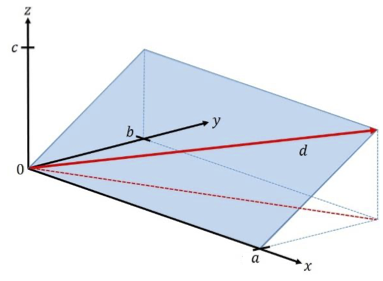

```{r include = FALSE, context = "setup"}
library(Zcalc)
library(Znotes)
```

## Making the grade

In this project we'll model energy consumption for walking uphill for a distance $d$ at grade $g$. The goal of this project is to determine whether there is an optimal grade that minimizes energy consumption per altitude gained. You'll translate your results into a recommendation to the National Park Service for designing challenging (but not too challenging!) hiking paths through a hilly terrain to reach a scenic viewpoint at the top of a hill or the crest of a ridge. Finally, you'll illustrate your findings by drawing an example of a suitable route for a path.

It's important to agree on some terminology. Figure 1 shows a simple mathematical model of a hillside. The coordinate system is $x$ and $y$ marking position on the horizontal plane and $z$ denoting the altitude of the hillside at any $x$, $y$ point.

```{r echo=FALSE, out.width="80%", fig.cap="Figure 1. The geometry of a model hillside"}

```

```{r echo=FALSE, fig.height = 6, fig.width=6, out.width="100%", warning=FALSE, fig.cap="Figure 2. A simple terrain near the top of a hill. The red vectors show the gradient of the function at the point marked by the root of the vector. These gradient vectors correspond to $y$ in Figure 1. The $x$ vector is perpendicular to each gradient."}
Blue <- tibble(y = c(38.53,  38.525, 38.527,38.5315), x= c(-104.57, -104.568,-104.565, -104.567))
tmp <- rfun(~ longitude + latitude, seed = 1033)
f <- makeFun(6000 - 100*tmp(70*(longitude+104.52),
                  50*(latitude - 38.51)) ~
               longitude + latitude)
tilde_expr <- f(longitude, latitude) ~ longitude + latitude
contour_plot(tilde_expr,
             domain(longitude = c(-104.6, -104.54),
                    latitude = c(38.52,38.57)),
             filled = FALSE) %>%
  gf_refine(coord_fixed(ratio=1/1.4)) %>%
  gradient_plot(f(x,y) ~ x + y, npts = 3,
                color = "red",
                domain(x = c(-104.57, -104.55),
                    y = c(38.53,38.56))) %>%
  gf_segment(38.53 + 38.525 ~ -104.57 + -104.568, inherit = FALSE, arrow = arrow(length = unit(.2, "cm"))) %>%
  gf_polygon(y ~ x, data = Blue, fill="light blue", color=NA, alpha = .7)
```


Admittedly, Figure 1 does not look much like a real hillside, but keep in mind that this is calculus. Figure 1 is a good representation of a *very small bit* of hillside. The $y$ axis in Figure 1 points directly uphill. To translate this to a bigger picture, focus on the gradient vector in Figure 2 located at (104.57 W, 38.43 N). We would align the $y$ vector in Figure 1 with the gradient vector in Figure 2. The $x$ vector in Figure 1 will translate into a vector that's perpendicular to the gradient vector. As a result the blue plane in Figure 1 corresponds to the small blue patch in Figure 2.

Refer back to Figure 1. The grade of the inclined plane, going in the steepest direction, is $c/b$, where $c$ is the height of the top of the inclined plane, and $b$ is the $y$-coordinate of the top. A person desiring to find a shallower grade can walk obliquely, as in path $d$. The red dashed line shows the route of this path on the $x,y$-plane, the the person is also ascending as they go up the path. So, starting with coordinate $(x=0, y=0, z=0)$, the person walking up path d will end up at coordinate $(x=a, y=b, z=c)$. Thus, the length of path d will be $\sqrt{a^2 + b^2 + c^2}$.

The grade of path d is the vertical distance divided by the horizontal distance (that is, the distance in the $x,y$-plane). This distance is $\sqrt{a^2 + b^2}$, so the grade of path d is $g_{path} = c / \sqrt{a^2 + b^2}$.

## Energy used

As described in class, the energy E consumed per unit distance (along the path) walked is $$E/d = (h + v g_{path})$$. According to the American College of Sports Medicine (ACSM), reasonable value are $h=0.1$ and $v=1.8$.

The ACSM handbook doesn't give units or dimension for $h$ and $v$. But you can figure them out from the units of energy over distance with the understanding that the dimension of both $h$ and $v$ are the same.

```{r daily-digital-37-QA1, echo=FALSE}
askMC(
  prompt = "What is the dimension of $g$?",
    "+dimensionless+" = "",
    "$L$" = "$g$ is a ratio of two lengths.",
    "$L^2$" = "$g$ is a ratio, not a product.",
    "$LT$" = "How could we add $h$ to $vg$ if $[vg]$ had time (or any other dimension) in it?",
  inline = FALSE
)
```

```{r daily-digital-37-QA2, echo=FALSE}
askMC(
  prompt = "What is the dimension of $E/d$?",
    "+$MLT^{-2}$+" = "",
    "$ML^2T^{-2}$" = "This is the dimension of energy.",
    "$M^2 L^2 T^2$" = "Remember, energy is mass times acceleration times length.",
    "$M L^2 T^2$" = "Energy is length times force. Force is mass times acceleration. Acceleration is length per time-squared."
)
```

## Applying the geometry

Our goal is to find path grade $g_{path}$ that will minimize the energy used to ascend a given height. For simplicity, let's assume that the height is 100 m.


Suppose the path has a grade $g_{path}$ and reaches a height of 100m. The distance $d$ in meters travelled along the path will be $g_{path} d = 100$ meters

```{r daily-digital-37-QA3, echo=FALSE}
askMC(
  prompt = "If the distance travelled along the path (solid red line in Figure 1) is $d$ meters, what is the length of the *horizontal* trace of the path (the dashed red line in Figure 1), given that the change in height is 100 meters?",
    "+$\\sqrt{d^2 - 100^2}$+" = "",
    "$\\sqrt{d^2 + 100^2}$" = "Shouldn't the dashed line be shorter than the solid line?",
    "$d$" = "If you're climbing 100 meters along the red line, it must be longer than the dashed line.",
    "Need additional information" = ""
)
```


```{r daily-digital-37-QA4, echo=FALSE}
askMC(
  prompt = "What is the grade of the path when the length of the path $d$ meters?",
    "+$g(d) \\equiv 100 / \\sqrt{d^2 - 100^2}$+" = "",
    "$g(d) \\equiv 100 / \\sqrt{d^2}$" = "Grade is rise over run. The run is always measured horizontally.",
    "$g(d) \\equiv \\sqrt{d^2 - 100} / 100$" = "Grade is rise over run, not the other way around.",
    "$100^2 / (d^2 - 100^2)$" = "Almost. This is the square of the grade."
)
```

According to the ACSM formula, the energy consumed in gaining an altitude of 100m over a path of length $d$ is $$E(g, d) = (h + v g)d$$

Since we have a formula for the grade as a function of distance, $g(d)$, we can re-write the ACSM energy formula as a function only of $d$. Find that formula for $E(d)$ and then program it as the function `Energy()` in the sandbox. Then make a plot of `Energy(d)` and locate the extremum by reading the graph. (You may have to zoom in on the domain. And remember, since the vertical climb is 100 meters, the shortest possible $d$ is---straight up the cliff!---100 meters.)


```{r daily-digital-37-sandbox1, eval=FALSE, exercise=TRUE, exercise.cap="Sandbox", exercise.eval=FALSE, exercise.lines=8, exercise.completion=FALSE, exercise.startover=TRUE, exercise.diagnostics=TRUE}
Energy <- makeFun( your_expression_here   ~ d)

slice_plot(Energy(d, v=1.8, h=0.1) ~ d, domain(d = c(min_here, max_here)))

```


It's a little easier to find the argmin of $d$ by calculating the derivative of `Energy()` with respect to `d` and looking for a zero crossing. Try that.


<!--
## Optimization by differentiation

DO WE WANT THEM TO DO SOME WORK ON PAPER, algebraically?

THE FOLLOWING IS FROM YOUR initial outline of the project:

For this model we can ask what grade should you select to gain say 100m of altitude while using the minimum amount of energy. A way to approach this problem is to define energy cost in terms of the run (we know the rise is 100). In this scenario the distance becomes √𝑥2+1002. Hence we get energy as a function of the run: 𝐸(𝑥)=(0.1+1.8⋅100𝑥)√𝑥2+1002.

Having them develop this model is important. Once they do, there are lots of possible questions:

1. Develop the model above

2. What is 𝑑𝑥𝐸(𝑥)

3. Where does the minimum occur?

4. What grade should we use?

5. How sensitive is the answer to the values of ℎ and 𝑣?

6. If solved algebraically, the optimal grade is 𝑔=√ℎ𝑣3. For the ACSM values this gives about 0.38.

7. There are lots of hidden assumptions in the values of ℎ and 𝑣. These are for walking a comfortable speed and I think it assumes the walker can take in fuel to maintain this speed for any grade for as long as needed.

-->


## Interpreting the optimal grade

By solving the minimization problem, you have found the *optimal* grade. In communicating your result, you should place it in context. For instance ...

* The ACSM values of $h=0.1$ and $v=1.8$ are *estimates*. Presumably there is some variation from one person to another as well as uncertainty in the estimate itself.
* The minimum might be *sharp* or *broad*. This is a question of how much changing the input value changes the output value.

How to take these matters into account when giving your recommendation for an optimal grade? Here are some ideas.

The ACSM is the American College of **Sports** Medicine. Presumably the people they studied are athletes, not necessarily typical visitors to a national part.

The following questions are to be answered in the GradeScope document for today's assignment:

> *Do you think a typical park visitor would have larger or smaller $v$ than an athlete? It's reasonable to think that $v$ might be different by a factor of 3 in non-athletes. How does such a change in $v$ change the argmin grade and the min of the energy?*


It may not be important to operate exactly at the argmin. What's important is that the energy expended not be crazy bad.

> *One way to think about how acceptable is a grade is to think about how sensitive the **output** of the energy function is to a change in grade. Pick some percentage change that you regard as hardly likely to be noticed by a park visitor. (Give some justification for your selected percentage, but of course there is no exact right choice.)  Translate your percentage into a range of distances $d$ that is consistent with a change in output less than your percentage. Then convert the range in $d$ to a range in $g$.*

## Communicating your result

Consider three levels of communication:

1. You report the argmin grade $g$ only. This provides the reader of your report with no context. Must the grade be exactly that? Try to avoid such narrow communication.
2. You report a range of acceptable grades. This way if the path designer runs into some problem with a particular path, he or she can consider reasonable alternatives.
3. You report (2), but you also translate that into terms that will be comfortable for a decision-maker who is not mathematically trained. (You might be surprised how many well-educated people do not assimilate percentages well.)

One way to help people visualize your recommended grade ... Pick a few real-world examples of paths, both steep and shallow. For example, there's the Manitou incline near Colorado Springs as an example of a steep hike. Heartbreak Hill in the Boston Marathon has earned it's name. Another example, pick a couple of streets in San Francisco, perhaps one with a cable-car running along it.

> *Report your results in the form of a table showing your recommendations alongside the real-world examples.* (Remember, you answer should be submitted via GradeScope.)


b. [Not used in Fall 2020] Draw some example paths on a real terrain. To support you in this task, here is a contour map of some imagined parkland. The contours are spaced 10 meters apart vertically and the axes give (horizontal) distance in meters.

Translate the upper and lower bounds of your grade interval (as in (2)) into a number of meters you must walk horizontally to go from one contour to the next. For instance, suppose your grade interval translate into 50 meters to 75 meters horizontally. (But use your own grade interval.)

Mark off on a ruler the horizontal distance that must be covered in going from one contour to another. (The red vertical bar in the top left is 50 meters long, the blue is 30 meters.) Then, from the starting point of the path, use that horizontal distance to connect to the next highest contour. Continue on from there, one contour at a time. If you find that the horizontal distance isn't sufficient to reach the next contour, then your grade will be shallower than the most efficient one. So be it.

Print out [this PDF version](map.pdf) of the map.  Then, using the method in the previous paragraph, draw a path connecting the starting point for the path to the scenic outlook at the top of the hill at a grade that is as close as you can get to the bottom bound on efficient grade that you found. The draw another path at the top bound for efficient grade. Hand in your maps.


```{r echo=FALSE, out.width="120%", warning=FALSE, fig.cap="The terrain on which to draw paths between the start and the point at the top of the hill. [PDF version for printing](hill.pdf)"}
tmp <- rfun(~ x + y, seed = 1388)
elevation <- makeFun(7000 - 15*tmp(x, y) ~ x + y)
contour_plot(elevation(x/100, y/100) ~ x + y,
           domain(x=c(-300,400), y=c(-500,125)),
           contours_at = seq(6950, 7270, by=10), skip = 2,
           filled = FALSE
) %>%
  gf_point(-375 ~ -220, color = "red") %>%
  gf_point( -130 ~ 90, color = "red") %>%
  gf_text(-400 ~ -200, label="start", color = "red") %>%
  gf_segment(120+70 ~ -250 + -250, color="red") %>%
  gf_segment(50 + 20 ~ -250 + -250, color = "blue") %>%
  gf_refine(coord_fixed())
```

-->
