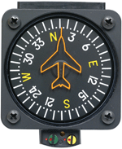

```{r include=FALSE}
library(Zcalc)
library(Znotes)
```


You're driving your aunt's car. The instrumentation includes an odometer (measuring distance, in miles), a speedometer (measuring speed, in miles/hour), and a fuel-economy readout that give you more or less instantaneous miles per gallon. It also has a compass to give your instantaneous heading.

Curious about whether the instantaneous fuel-economy reading is accurate, you've hooked up your Daily-Digital™ Easy-Data-Recorder© to the car's digital port and set it to record speed (`speed()`), fuel-economy (`mpg()`), heading (`heading()`), and incline (`slope()`). You set out on your trip, your friend turns on the Daily-Digital™ Easy-Data-Recorder© and you record for 1 hour. 

After you reach your destination, you download the recording, which is in the form of R functions (see names above) which take **time in minutes** as an input and return respectively miles-per-hour, miles-per-gallon, heading in degrees (with 0 being North), and incline in degrees. 


Here are graphs of the recorded functions. 

```{r fig.height=2, out.width="100%", echo=FALSE}
slice_plot(speed(t) ~ t, domain(t=c(0,60)), npts=500) %>%
  gf_labs(y = "Speed (miles/hour)", x="Time (minutes)", title="Car speed")
slice_plot(mpg(t) ~ t, domain(t=c(0,60)), npts=500) %>%
  gf_labs(y = "MPG (miles/gallon)", x="Time (minutes)", title="Dashboard MPG readout")
slice_plot(heading(t) %% 360 ~ t, domain(t=c(0,60)), npts=500) %>%
  gf_labs(y = "heading (deg from North)", x="Time (minutes)", title="Car heading")
slice_plot(slope(t) ~ t, domain(t=c(0,60)), npts=500) %>%
  gf_labs(y = "Slope of road (deg)", x="Time (minutes)", title="Road grade")
```
A first step in working with data is to make sure the data are what you think they are. (If you're wrong about this, it's hardly likely that your interpretation will be correct!)  Answer the following questions, which should only take a few minutes. No detailed calculations are necessary at this stage.

**Question A.** Notice that all four of the graphs have time on the horizontal axis. Explain briefly why this is appropriate to the way the data were collected.

**Question B.** In your head, for each quantity displayed on the vertical axis, construct a constant function of time that corresponds roughly to the data as plotted. That function would graph as a horizontal line. The vertical position of the horizontal line should be "in the middle" of the values taken on by the actual data. For each graph, pick a reasonable numerical value, giving units. You should be able to do this with a glance at the graph and the vertical axis scale. Rough values will do.

**Question C.** Referring to the values you selected for Question B, explain briefly what the values and their units mean, e.g. on average how fast the car is going, what direction (e.g. northwest) is the car traveling, whether the overall trip is mostly uphill or downhill, how far the car can travel on a gallon of gasoline.  

**Question D.** Pick two of the quantities---your choice---that appear to be related to one another and describe that relationship in everyday English.

----

**Now we turn to questions** that are to be answered quantitatively, using the tools of calculus and mathematics generally. The "raw materials" you will work with are the functions functions `speed(t)`, `mpg(t)`, `slope(t)`, and  `heading(t)`  Each question can be approached in a similar way:

i. Choose or construct a function that gives an "instantaneous" value for an appropriate quantity. For instance, the `heading()` function gives the instantaneous direction that the car is pointing at each instant of time.    
    
Depending on the question, you might be able to use one of the "raw-material" functions directly, or you might need to combine two or more of the functions by multiplication, division, or use of a trigonometric function such as `sin()` or `cos()`. When you use such a combination, it's a good practice to give an explicit name to the function. For instance---and this is a silly, utterly meaningless combination used just for the example:
    
```r
instant_o2_consumption <-   
  makeFun(heading(mpg(t))/slope(t) ~ t)
```

ii. Construct the anti-derivative of the function in (i). You can do this with `antiD()`, no creative thought is needed for this step.

iii. Use the anti-derivative function from (ii) in some way that will answer the question. For instance, using the anti-derivative to evaluate a "definite integral" may be appropriate in some cases. Graphing the anti-derivative as a function of time may be appropriate in other cases. 

For each of the four quantitative questions you will 

a. Make the quantitative calculation, getting a numerical result in each case. In addition to running your computer code, you will copy and paste that code into the appropriate space on the submission form. Only the code in the box needs to be submitted, not the graphical or other outputs.
b. Copy the numerical value in the output from (a) into the appropriate space on the submission form. The units of the value are specified in the question statement.
c. Give a **brief** English-language justification for the instantaneous function you used or constructed in your answer **and** what justifies your using/evaluating/plotting the anti-derivative of that function in the way you did. (Silly example to illustrate the form: "The ultimate answer should be a volume in cubic meters. So the instantaneous function `rate_of_volume(t)` should have an output in cubic meters per second. I can get this by multiplying the `area(t)` function and the `speed(t)` function. I graphed the anti-derivative of `rate_of_volume(t)` to look for the time at which it crosses zero.")


General Hints: 

1) You will need to pay careful attention to units, especially that time is in minutes while speed is in miles-per-hour.
2) You will have to combine the miles-per-hour function and the miles-per-gallon function in order to produce a new function that is gallons-per-hour. You can integrate that new function to find the fuel usage. Be thoughtful about whether you need miles-per-gallon or its reciprocal, gallons-per-mile.
3) The `heading(t)` function gives direction in degrees from north in the standard way for navigation. 
    
```{r echo=FALSE, out.width="20%", fig.align="center"}

```
       
*Note that the compass pictured leaves the last zero off the degree reading. What's marked as 24 is really 240 degrees.*
    
The east-west component of this direction is `sin(heading(t)*pi/180)`; the north-south component is `cos(heading(t)*pi/180)`. The `pi/180` factor converts the unit "degrees" into the unit "radians" so that they will make sense as inputs to the `sin()` and `cos()` functions. 
4) A mile is 5280 feet or 1609.34 meters. There are---as you are well aware---60 minutes in an hour and 3600 seconds in an hour.
5) Even if you don't drive, you likely know something about how far a car can travel in an hour or how much fuel is used during that time. You also know about altitudes in the mountains. If the mathematics gives you an answer that is crazy big or crazy small, check the units. You might have forgotten to convert them to the units asked for in the question. Example: If you integrate miles/hour with respect to minutes, what you get is miles (minutes/hour). That quantity has dimension L, but the units miles (minutes/hour) are not the same as miles.


**Quantitative Question 1**: How far did you travel? (Answer: units in miles)

<!--
Displacement <- antiD(speed(t) ~ t)
(Displacement(60) - Displacement(0))/60
-->

```{r one, exercise=TRUE, exercise.cap="How far did you travel?", exercise.nlines=6, eval=FALSE}

```
Your answer should have three components:
a. your R code
b. the numerical answer 
c. a brief explanation of your reasoning

**Quantitative Question 2**: The end-destination was how far north of the departure point? (Answer: units in miles. Note that displacement can be positive or negative.  Interpret the answer appropriately.)

<!-- 
North_displacement <- antiD(speed(t)*cos(pi*heading(t)/180) ~ t)
(North_displacement(60) - North_displacement(0))/60
-->


Your answer should have three components:
a. your code
b. the numerical answer
c. a brief explanation of your reasoning

**Quantitative Question 3**: At what time did you reach the maximum altitude **and** what was that altitude? (Answer will be two numbers, one having units of minutes -after-start and the other having units of feet.)

<!--
Climb_rate <- makeFun(speed(t)*sin(slope(t)*pi/180)*5280/60 ~ t)
Altitude <- antiD(Climb_rate(t) ~ t)
slice_plot(Altitude(t) ~ t, domain(t=c(0,60)), npts=500)
-->

Once again, your answer should have three components: 
a. your code
b. the numerical answer
c. a brief explanation of your reasoning.


**Quantitative Question 4**. How much fuel did you use during the recording? (Answer: units in gallons.)

<!--
fuel_use_rate <- makeFun(speed(t)/mpg(t) ~ t)
Fuel_use <- antiD(fuel_use_rate(t) ~ t)
(Fuel_use(60) - Fuel_use(0))/60
-->

Once more, your answer should have three components:
a. your code
b. the numerical answer
c. a brief explanation of your reasoning
